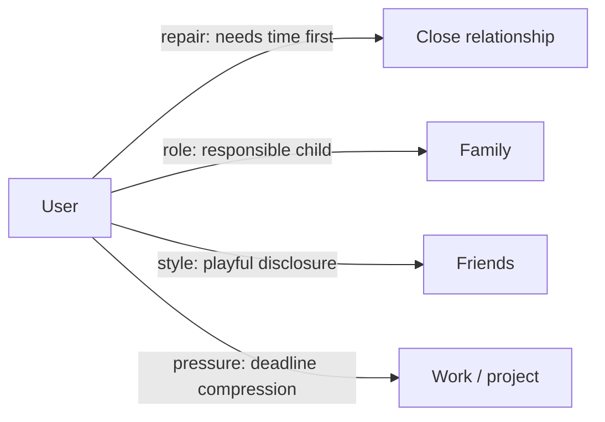
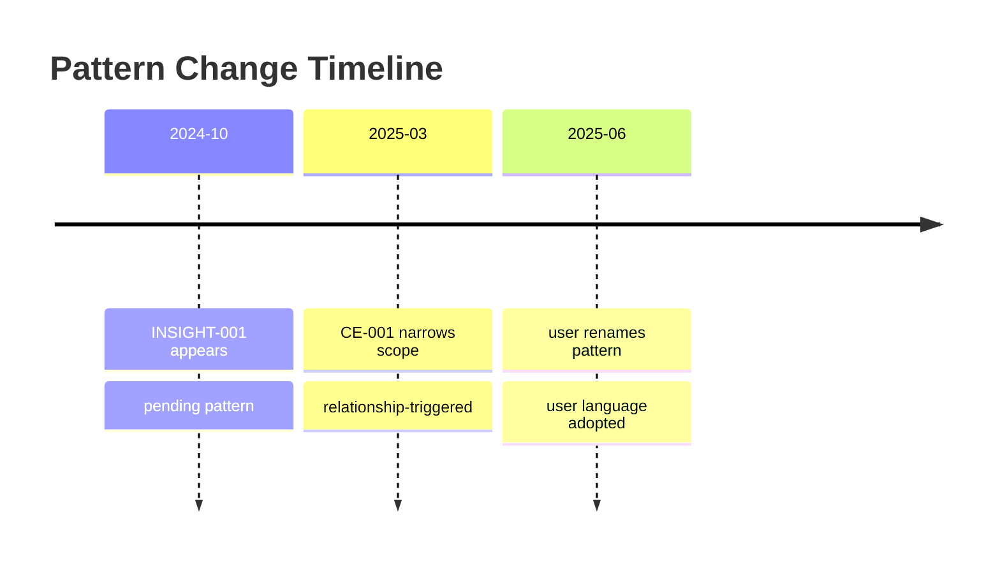

# Visual Templates v0.6

Use these templates when presenting Living Mirror results in docs, social posts, slides, or dashboards. Keep private data out of visuals unless the user explicitly approves.

## Relationship Map

## Change Timeline

## Evidence Ledger

| Insight | Supporting evidence | Counter-evidence | Confidence | Status |
|---|---|---|---|---|
| INSIGHT-001 | verbatim + artifact | CE-001 | evidence=medium; interpretation=medium; stability=low | pending |

## Context Dashboard

| Context | Weight | Affected insight | Caution |
|---|---|---|---|
| Deadline weeks | high | INSIGHT-001, INSIGHT-002 | Do not promote stress behavior into stable trait |
| Text medium | medium | INSIGHT-001 | Silence may mean delay, not refusal |

## User-Language Glossary

| User phrase | Distiller label | Adopted | Replacement rule |
|---|---|---|---|
| "I need a little time" | distance before repair | yes | Use user phrase first |

## Xiaohongshu / Social Card Copy

### Card 1

Title: 见己镜 v0.6

Copy: 不是给人贴标签，而是把证据、反证、情境和用户自己的语言放在同一张桌面上。

### Card 2

Title: 每条洞察都要能被推翻

Copy: v0.6 会记录 `CE-XXX` 反证索引：例外、相反证据、替代解释，都不能被藏起来。

### Card 3

Title: 人不是一个固定结论

Copy: 同一条模式会被拆成事实、解释、命名、情境权重和三段置信度。

