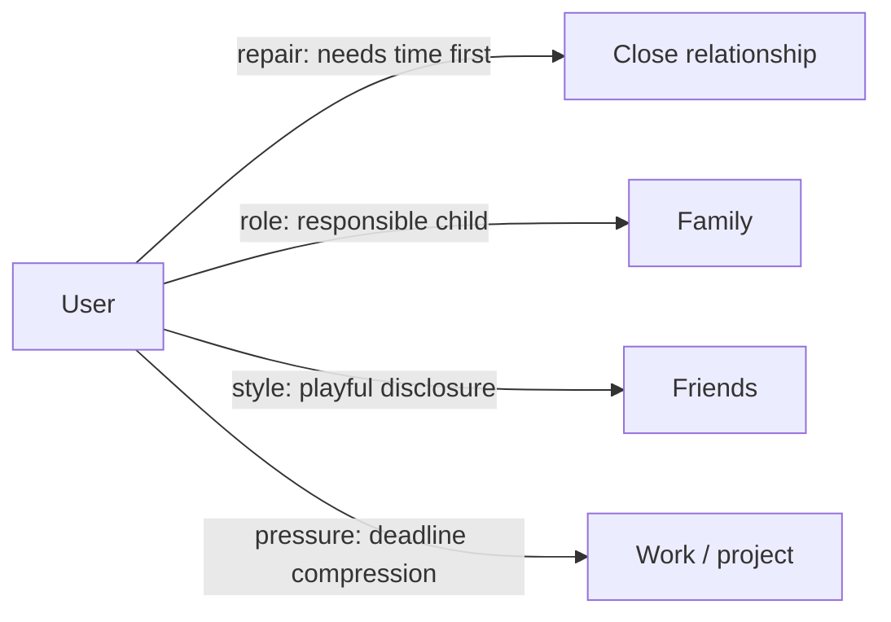
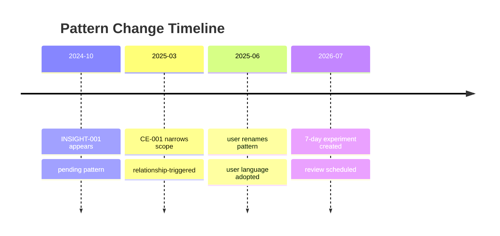

# Visual Templates for Skill Pack v0.9

Use these templates when presenting Living Mirror results in docs, social posts, slides, dashboards, or public case studies. Keep private data out of visuals unless the user explicitly approves.

## Relationship Map

## Change Timeline

## Evidence Ledger

| Insight | Supporting evidence | Counter-evidence | Confidence | Review state |
|---|---|---|---|---|
| INSIGHT-001 | verbatim + artifact | CE-001 | evidence=medium; interpretation=medium; stability=low | needs_more_evidence |

## Context Dashboard

| Context | Weight | Affected insight | Caution |
|---|---|---|---|
| Deadline weeks | high | INSIGHT-001, INSIGHT-002 | Do not promote stress behavior into stable trait |
| Text medium | medium | INSIGHT-001 | Silence may mean delay, not refusal |

## Action Card

| Linked insight | Tiny action | Observation | Review date | Stop condition |
|---|---|---|---|---|
| INSIGHT-001 | Send one clear boundary sentence | Relief, fear, response pattern | YYYY-MM-DD | Stop if it becomes unsafe or coercive |

## User-Language Glossary

| User phrase | Distiller label | Adopted | Replacement rule |
|---|---|---|---|
| "I need a little time" | distance before repair | yes | Use user phrase first |

## Xiaohongshu / Social Card Copy

### Card 1

Title: 见己镜 Skill Pack v0.9

Copy: 不是给人贴标签，而是把证据、反证、情境、复核和行动放在同一张桌面上。

### Card 2

Title: 没有数据也能开始

Copy: Skill Pack v0.9 加入冷启动访谈和数据体检。核心蒸馏框架仍是 v0.6，先生成一版“待验证自画像”，再慢慢用真实记录校准。

### Card 3

Title: 每条洞察都能被推翻

Copy: 重要判断必须写清楚证据、三段置信度、可推翻条件和 `CE-XXX` 反证索引。

### Card 4

Title: 看懂之后，还要能行动

Copy: 把洞察转成 7 天行动实验、沟通脚本、边界句子和关系修复地图。

### Card 5

Title: 可以展示，但不暴露生活

Copy: private / shareable / public 三种隐私等级，公开稿先脱敏，再发布。
